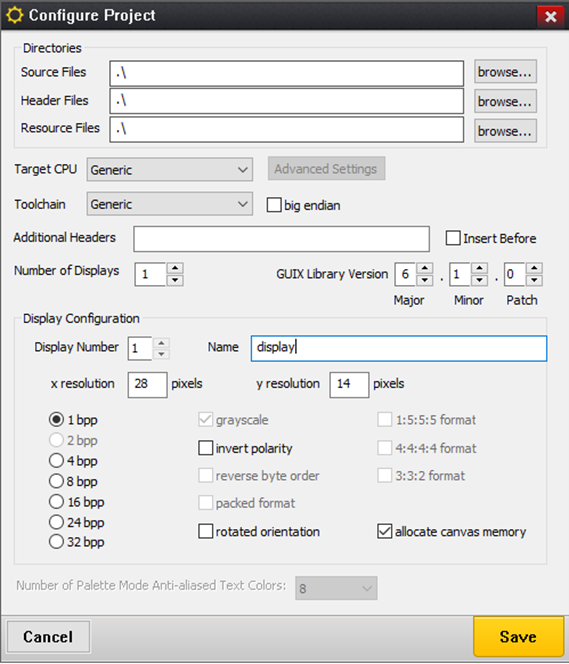
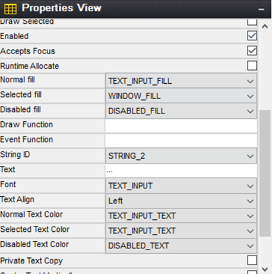

# Azure RTOS GUIX driver for AlfaZeta Flip-Dot boards XY5 on Azure Sphere MT3620 development kit

This repo contains a sample GUIX display driver for a the 28x14 Flip-Dot panel from AlfaZeta ([Flip-Dot boards XY5](https://flipdots.com/en/products-services/flip-dot-boards-xy5/)) to be used on an Azure Sphere MT3620 development kit. The repository also contains a simple emulator in the form of a Windows application that allows testing the display driver without the actual Flip-Dot hardware.

## Prerequisites

### Hardware

#### Azure Sphere MT3620 develpoment kit

In order to follow this tutorial along you will need an [Azure Sphere MT3620 development kit](https://www.mediatek.com/products/AIoT/mt3620) from MediaTek. Note that you can certainly try this out on some other board that supports Azure RTOS ThreadX.


#### Flip-Dot panel

The Flip-Dot panel used is from the Polish company [AlfaZeta](https://flipdots.com/en/home/) and is a 28x14 magnetic flip dots panel called [Flip-Dot Boards XY5](https://flipdots.com/en/products-services/flip-dot-boards-xy5/).


The Flip-Dot panel is controlled via a wire protocol over RS485, and you need to connect the board's GND , 5V and TXD0 pins to the Flip-Dot controller as indicated in the hardware documentation. Here is the MT3620 pinout for reference:


#### ... Or a Serial-USB adapter to use the Flip-Dot panel emulator

If you don't have the chance to have one of these panels at hand, there is an emulator in the form of a Windows application that you can use connecting the MT3620 to your PC using a Serial-USB adapter. This allows testing the exact same code without the actual panel.


In order to use the Flip-Dot emulator, get it from [Mike Hall's GitHub repo](https://github.com/mikehall-ms/flipdot-emulator). To send commands to the emulator from the device serial port, you will need a **Serial to USB adapter**. We recommend using one that uses an FTDI chip as these are way less problematic if you are running Windows 10 on your development machine. Here is a [good one from DSD Tech](https://www.amazon.com/gp/product/B07BBPX8B8/ref=ppx_yo_dt_b_asin_title_o00_s00?ie=UTF8&psc=1) which works perfectly and costs less than $10:


Connect the MT3620 board's GND and TXD0 pins to the GND and RXD pins of the adapter.

### Software

In order to develop for Azure Sphere and deploy an Azure RTOS application with a GUIX UI you will need a PC running Windows or Linux and install Visual Studio 2019 or Visual Studio Code and the Azure Sphere SDK.

- Azure Sphere development setup: Follow the instructions in the [QuickStart](https://docs.microsoft.com/azure-sphere/install/overview) 
- Real Time application development setup: Follow the instructions in this [tutorial](https://docs.microsoft.com/azure-sphere/install/qs-real-time-application)
- Azure RTOS GUIX Studio (for Windows only): If you want to customize the UI, follow the instructions in the [GUIX GitHub repository](https://github.com/azure-rtos/guix) to install the tool.
- In order to clone this repository, you can do it directly from Visual Studio or Visual Studio code, or install [Git](https://git-scm.com/downloads) on your machine.

## Clone-Deploy-Run

The current repository contains all the code you need to just deploy and run.
Make sure you went through the hardware and software requirements above:

- Software:
  - You have Visual Studio or VS Code installed as well as the Azure Sphere SDK
  - You went through the Real Time application development setup
  - You have [Git](https://git-scm.com/downloads) installed on your machine
- Hardware
  - You connected the MT3620 board serial port to the Flip-Dot panel as instructed in the panel docs
  - OR... You connected the MT3620 board serial port to your Windows PC through the Serial-USB adapter, got the Flip-Dot emulator, run it and select the Serial port corresponding to your serial-USB adapter port (you can find which port it is running the command ```mode``` in a command prompt or looking in the Device Manager).

To clone the repository and its submodules, type the following command (it is assuming you have git installed on your machine)

```bash
git clone https://github.com/olivierbloch/Azure-RTOS-GUIX-Flip-Dot-Display-Driver --recursive
```

Then compile and deploy the application hitting ```F5```

## Do it all from scratch

If you want to do it all from scratch, below are all the steps demoed in this video:

- [Create a real-time application for Azure Sphere](#Create-a-real-time-application-on-azure-sphere)
- [Add MT3620 libraries](#mt3620-libraries) from CodethinkLabs to access the MT3620 hardware resources from the TreadX app
- [Bring in ThreadX](#bring-in-threadX)
- [Bring in GUIX](#bring-in-guix)
- [Put together the GUIX driver for the Flip-Dot](#write-the-guix-display-driver)
- [Create a simple UI with GUIX Studio](#create-the-ui-for-the-application-with-guix-studio)

### Create a real-time application on Azure Sphere

In order to develop for Azure Sphere and Azure RTOS, you need a Windows or Linux machine. Instructions for setting up the development environment for Azure Sphere can be found in the [Azure Sphere docs](https://docs.microsoft.com/azure-sphere/install/overview). Once the Azure Sphere tools are installed, in order to create Real-Time applications, you need to add some more tools and resources as described in this [tutorial](https://docs.microsoft.com/azure-sphere/install/qs-real-time-application).
Once all is setup, open VS Code, bring up the command palette (CTRL+SHIFT+P) and type ```Azure Sphere: Generate New Project```


Pick **RTCore Blank**


Select a location ofr the project and enter a name


Before starting work on the real-time application, you need to configure the Azure Sphere app manifest to allow the app to access the serial port. In the app_manifest.json file, add the Uart capability:

```json
  "Capabilities": {
    "Uart": [ "ISU0" ]
  },
```

At this point you are ready to start playing!

### MT3620 libraries

In order to access the MT3620 hardware resources from the ThreadX real-time application, you will need libraries. There are several options out there. MediaTek has libraries you can find on [GitHub](https://github.com/MediaTek-Labs/mt3620_m4_software) with a BSP, hardware drivers and samples. In this project we are using a lighter alternative by [Codethink Labs](http://codethink.co.uk/). Drivers are in this [repo](https://github.com/CodethinkLabs/mt3620-m4-drivers), while samples in this [other one](https://github.com/CodethinkLabs/mt3620-m4-samples).
Bring in the drivers in the project using the following command line from the folder of the project:

```bash
git clone https://github.com/CodethinkLabs/mt3620-m4-drivers.git mt3620_lib
```

In order to configure the ThreadX lower layers for the MT3620 hardware, you need a couple files from the Codethink Labs sample for running ThreadX on the MT3620 (you can find the said sample [here](https://github.com/CodethinkLabs/mt3620-m4-samples/tree/master/ThreadX_RTApp_MT3620_AzureRTOS)). Files being in the samples repo, just clone it with the following command:

```bash
git clone https:// github.com/CodethinkLabs/mt3620-m4-samples.git
```

The default main.c file that is created when using the VS Code RTCore Blank template comes with generic code that needs to be adapted to the targeted board. The main function consists simply in initializing the VectorTable and CPU frequency and then invoking the ThreadX main (which lives in another file). Here is what the main file looks like after editing (inspired by the ThreadX for MT3620 sample in the Codethink Labs repo):

```c
#include "CPUFreq.h"
#include "VectorTable.h"

extern int main(void);

_Noreturn void RTCoreMain(void)
{
    // Init Vector Table
    VectorTableInit();

    // Set CPU clock
    CPUFreq_Set(197600000);

    // Invoke ThreadX main
    main();

    for (;;) {
    __asm__("wfi");
    }
}
```

### Bring in ThreadX

Once you have the Azure Sphere part ready to host ThreadX for the Real-Time app, you need to clone the ThreadX repo into the project, add a .c file and edit the CMake configuration file (CMakeLists.txt).
Here is the git command to bring in ThreadX (to run from the project folder):

```bash
git clone https://github.com/azure-rtos/threadx.git
```

And here is the threadx_app.c file to add:

```C
#include "tx_api.h"

// ThreadX app main entry point
int main(void)
{
    /* Enter the ThreadX kernel.  */
    tx_kernel_enter();

    return 0;
}

// ThreadX application setup
void    tx_application_define(void *first_unused_memory)
{

}
```

To learn more about how ThreadX apps work and are setup, we recommend checking out this [article](https://docs.microsoft.com/en-us/azure/rtos/threadx/chapter2#using-threadx).
With all this code in place, it is time to do a little compile check. And for that, you need to edit the CMakeLists.txt file to indicate to the compiler and linker which target, files, includes folders, etc to use for this project. Here is the updated CMakeLists.txt file:

```
cmake_minimum_required (VERSION 3.10)
project (My_RTCore_App C ASM)
SET(CMAKE_ASM_FLAGS "-mcpu=cortex-m4")
azsphere_configure_tools(TOOLS_REVISION "20.10")
ADD_COMPILE_DEFINITIONS(OSAI_BARE_METAL)
ADD_LINK_OPTIONS(-specs=nano.specs -specs=nosys.specs)
configure_file( ${CMAKE_HOME_DIRECTORY}/mt3620-m4-samples/ThreadX_RTApp_MT3620_AzureRTOS/linker.ld
    ${CMAKE_HOME_DIRECTORY}/linker.ld
    COPYONLY)
include_directories(${CMAKE_SOURCE_DIR} 
	  ${CMAKE_SOURCE_DIR}/mt3620_lib
	  ${CMAKE_SOURCE_DIR}/mt3620_lib/mt3620)
# Create executable
add_executable (${PROJECT_NAME}
    mt3620-m4-samples/ThreadX_RTApp_MT3620_AzureRTOS/tx_initialize_low_level.S
    mt3620-m4-samples/ThreadX_RTApp_MT3620_AzureRTOS/VectorTable.c
    threadx_app.c
    main.c)

set(THREADX_ARCH "cortex_m4")
set(THREADX_TOOLCHAIN "gnu")
add_subdirectory(threadx)

target_link_libraries (${PROJECT_NAME}  azrtos::threadx )
set_target_properties (${PROJECT_NAME} PROPERTIES LINK_DEPENDS ${CMAKE_SOURCE_DIR}/linker.ld)
azsphere_target_add_image_package(${PROJECT_NAME})
```

A little CRTL+SHIFT+P to bring the command palette in VS Code, then type CMake:Build and here is the first joy of an embedded developer: “It builds!”.

### Bring in GUIX

One of the great things with Azure RTOS and its services is that they each come in their own repository easy to add to a project. That makes things really modular and optimized for embedded development.
Clone the GUIX repository:

```bash
git clone https://github.com/azure-rtos/guix.git
```

In the threadx_app.c file, add the following header, defines, variables, as well as the function for the main GUIX thread (stdio.h is needed as we’ll be using printf in the code):

```C
// Standard headers
#include <stdio.h>

// ThreadX and GUIX headers
#include "tx_api.h"
#include "gx_api.h"

// GuiX Thread resources
#define         GUIX_THREAD_STACK_SIZE 4096
#define         GUIX_THREAD_PRIORITY   4

TX_THREAD       guix_thread;
UCHAR           guix_thread_stack[GUIX_THREAD_STACK_SIZE];

// GUIX main thread
VOID guix_thread_entry(ULONG thread_input)
{
    /* Initialize GUIX.  */
    gx_system_initialize();

    /* start GUIX thread */
    gx_system_start();
}
```

Then create the GUIX thread in the ThreadX application setup:

```c
// ThreadX application setup
void    tx_application_define(void *first_unused_memory)
{
    // Create the GUI thread.
    UINT status = tx_thread_create(&guix_thread, 
            "GUIX Thread", 
            guix_thread_entry, 
            0, 
            guix_thread_stack,
            GUIX_THREAD_STACK_SIZE,
            GUIX_THREAD_PRIORITY,
            GUIX_THREAD_PRIORITY, 
            TX_NO_TIME_SLICE,
            TX_AUTO_START);

    if (status != TX_SUCCESS)
    {
        printf("GUI Init failed, please restart\r\n");
    }
}
```

To compile GUIX with the application, you need to make the following edits/additions in the CMakeListst.txt file: 

```
add_executable (${PROJECT_NAME}
    mt3620-m4-samples/ThreadX_RTApp_MT3620_AzureRTOS/tx_initialize_low_level.S
    mt3620-m4-samples/ThreadX_RTApp_MT3620_AzureRTOS/VectorTable.c
    threadx_app.c
    main.c
    )

add_subdirectory(threadx)
add_subdirectory(guix)
target_link_libraries(${PROJECT_NAME} azrtos::threadx azrtos::guix)
```

Another ```CMake:Build``` command to make sure everything is alright before moving on to the display driver.

### Write the GUIX display driver

Once you have ThreadX and GUIX added to the project you can focus on putting together the driver for the Flip-Dot panel.
For a display as simple as the Flip-Dot, you don't have much to implement in the driver as you can rely on almost all default implementations in GUIX. You only need to write the setup function as well as the buffer toggle one used to map and send the canvas data to the display.
The Flip-Dot panel is controlled over a serial connection using a simple protocol that Alfazeta shares when you purchase one of their panels. In the case of the 28x14 panel, which is composed of 2 trays of 28x7 pixels, it consists in sending 2 frames (one for the top tray with 7 lines, and a second one for the lower tray with 7 lines) containing the following data structure:

| # bytes | Value | Description |
| :--------- | :------------- | :-------------------------------------------- |
| 1  | 0x80 | Frame start byte |
| 1  | 0x83 | Command byte (0x83=send to display) |
| 1  | 0x00 or 0x01 | Address (indicating which tray to send data to) |
| 28 | Pixels data | Data to be sent to display |
| 1  | 0x8F | Frame end byte |

For the way the pixels data is formatted, you can check out the code below in the display driver used to map from the GUIX canvas to the physical one.
For the display driver, you need to create 2 files in the project: flipdot_graphics_driver_setup.h and flipdot_graphics_driver_setup.c
In the header file, declare the setup function:

```c
#include "gx_api.h"
#include "gx_display.h"

UINT flipdot_graphics_driver_setup(GX_DISPLAY *display);
```

In the flipdot_graphics_driver_setup.c file which is shown below in its entirety, you can see the main driver setup function flipdot_graphics_driver_setup that initializes the serial port (leveraging the mt3620 library from Thinkcode Labs), sets up some local resources for managing the frame buffer mapping and then invokes the default GUIX monochrome display setup function pointing to a flipdot_buffer_toggle function meant to be invoked by GUIX when refresh of the display is needed.
The flipdot_buffer_toggle function is pretty straight forward as well, mapping the GUIX abstract canvas into the physical display buffer and then sending data to the Flip-Dot panel over the serial port.

```c
#include "flipdot_graphics_driver.h"
#include "UART.h"

// Serial port stuff
#define FLIPDOT_UART MT3620_UNIT_ISU0
UART *driver = NULL;

// Flipdot hardware stuff
typedef struct {
    unsigned char frameStart;
    unsigned char command;
    unsigned char address;
    unsigned char data[28];
    unsigned char frameEnd;
} flipFrame;

flipFrame frame;

const static unsigned char cmd_sendToDisplay = 0x83;

unsigned char bFlipDisp[56];  // the logical display buffer.
unsigned char bOutBuffer[56];  // the vertical stripe reverse horizontal flip-disc display buffer (aka format expected by FlipDot controller).

const unsigned int mask[] = { 128,64,32,16,8,4,2,1 }; // Mask used to shift data
const unsigned int getMask[] = { 128, 64, 32, 16, 8, 4, 2, 1 };
const unsigned int setMask[] = { 64, 32, 16, 8, 4, 2, 1 };

// map the pixel x,y display to reverse vertical stripes (format expected by the Flipdot controller).
void map_logical_display_to_physical_display(void)
{
    int dispPtr = 0;
    int tray = 0;
    // do this in two sections since display 0 and 1 are each 28 bytes.
    for (tray = 0; tray < 2; tray++)
    {
        int x = 0;
        // now vertical stripe the pixels for each panel.
        for (x = 27; x > -1; x--)    // walk the map backwards.
        {
            unsigned int outByte = 0x00; // the vertical stripe
            int y = 0;
            for (y = 0; y < 7; y++)
            {
                int bytePos = x / 8; // get the byte offset for this stripe
                int bitPos = x % 8; // get the bit offset for this stripe
                int buffPos = (y * 4) + bytePos;
                unsigned int bByte = bFlipDisp[(28 * tray) + buffPos];
                unsigned int iSet = bByte & getMask[bitPos];
                if (iSet != 0)
                {
                    outByte |= setMask[y];
                }
            }
            bOutBuffer[dispPtr++] = (unsigned char)outByte;
        }
    }
}

// Main buffer toggle function for the driver
static void flipdot_buffer_toggle(GX_CANVAS *canvas, GX_RECTANGLE *dirty)
{
    // Copy canvas to logical diplay buffer
    memcpy(bFlipDisp, canvas->gx_canvas_memory, 56);

    // Map to physical display
    map_logical_display_to_physical_display();

    // Send to flipdot
    // top display
    frame.address = 0x00;
    // copy the top display data.
    memcpy(frame.data, bOutBuffer, 28);
    // write the data
    UART_Write(driver, (unsigned char*)&frame, sizeof(frame) );
    tx_thread_sleep(3);

    // bottom display
    frame.address = 0x01;
    // copy the top display data.
    memcpy(frame.data, (bOutBuffer)+28, 28);
    // write the data
    UART_Write(driver, (unsigned char*)&frame, sizeof(frame) );
    tx_thread_sleep(3);

}

// Driver setup
UINT flipdot_graphics_driver_setup(GX_DISPLAY *display)
{
    // Init serial port
    driver = UART_Open(FLIPDOT_UART, 57600, UART_PARITY_NONE, 1, NULL);

    // Init frame buffer
    memset(bFlipDisp, 0x00, 56);

    // setup the basic display frame
    frame.frameStart = 0x80;
    frame.command = cmd_sendToDisplay;
    frame.frameEnd = 0x8f;
    frame.address = 0x00; // top display

    // perform standard function pointer setup
    _gx_display_driver_monochrome_setup(display, GX_NULL, flipdot_buffer_toggle);

    return GX_SUCCESS;
}
```

Before moving on, add the driver file as well as the UART driver from the Codethink Labs library to the CMakeLists.txt file:

```
add_executable (${PROJECT_NAME}
    mt3620-m4-samples/ThreadX_RTApp_MT3620_AzureRTOS/tx_initialize_low_level.S
    mt3620-m4-samples/ThreadX_RTApp_MT3620_AzureRTOS/VectorTable.c
    mt3620_lib/UART.c
    flipdot_graphics_driver.c
    threadx_app.c
    main.c
    )
```

Do the usual “does it still compile?” test before moving on.

### Create the UI for the application with GUIX Studio

You could have written the rest yourself (the actual UI), leveraging the GUIX APIs, creating Windows and Widgets and more by hand. At the end of the day, for a UI as simple as the one we want to build here for the panel, 2 lines of text, that wouldn’t have been too much of a hassle. But why bother when you can use a WYSIWYG tool that generates the code for you, right?
If you have not done so yet, [install GUIX Studio](https://docs.microsoft.com/azure/rtos/guix/guix-studio-2) and open it up.

Create a new project called flipdot_guix and place it in my My_RTCore_App project folder.


Configure the project setting up the display name, the resolution (28x14) and the color (1bpp):



By default you get a windows widget which is the main window of my GUI. With so little real estate and with the ambition of only displaying some text for now, add a multiline text view filling the whole window. The default window comes with a thin border which would use a pixel all around my display, and you can’t afford that. Make sure the border setting for the window is set to None. Also check the box indicating that the window should be visible at startup:


After zooming in to the max level (28x14 UIs are not common 😊), right click on the windows widget to add the multiline text view:


Set the text view position to 0,0 and size to 28, 14, and remove the border.


Scrolling down in the text view properties, change the default text to “…”, and align it to the left.



But here you can see the issue with such a low resolution: the font! The default TEXT_INPUT font is 18 pixels high… which definitively won't work for our low resolution display. We found a nice 3x5 font on [fontstruct.com](https://fontstruct.com/fontstructions/show/1404325/cg-pixel-4x5-2) that works great. Copy the ttf file to the project folder. In GUIX Studio go to the Fonts menu, click **Add New Font**, select the ttf file, name it flipdotfont3by5, set a Font Height of 5 pixels, then hit save.


Set the font for the text view widget as well as a line space of 2 pixels in order to get 2 lines of text on the display (1 blank pixel on top, 5 pixels characters, 2 blank spaces between text lines, 5 pixels characters, 1 blank pixel at the bottom = 14 total pixels):


Before leaving GUIX Studio go back to the main window properties to set an Event Function called **main_event_process** which will be used for some event management on the window:


Last thing left to do is to generate all the resource files using the menu **Project | Generate All Output Files**:


The Graphical User Interface resources have now been generated by the tool which created the following files:

-	flipdot_guix_resources.c and flipdot_guix_resources.h: containing the GUIX resources (font, display them, color map,…)
-	flipdot_guix_specifications.c and flipdot_guix_specifications.h: containing the specifications and functions for the GUI Widget (in my case, the main window, the text view)

For these files to be compiled with the project you need to add them to the CMakeLists.txt file as follows:

```
add_executable (${PROJECT_NAME}
    mt3620-m4-samples/ThreadX_RTApp_MT3620_AzureRTOS/tx_initialize_low_level.S
    mt3620-m4-samples/ThreadX_RTApp_MT3620_AzureRTOS/VectorTable.c
    mt3620_lib/UART.c
    flipdot_graphics_driver.c
    flipdot_guix_resources.c
    flipdot_guix_specifications.c
    threadx_app.c
    main.c
    )
```

Back to the threadx_app.c file to add the window and its widgets. In order to have something happening on the display besides just displaying text, we want to have a simple timer that would change the text every second, alternating between “Hello World” and “Hello World .”, resulting in a blinking dot.
Add the following to the threadx_app.c file:

```c
#include <stdbool.h>
#include "tx_api.h"
#include "gx_api.h"
#include "flipdot_guix_resources.h"
#include "flipdot_guix_specifications.h"
#include "flipdot_graphics_driver.h"

// GUIX Windows
GX_WINDOW_ROOT  *root;

// Timer for ticker refresh
#define         CLOCK_TIMER         20
static bool  ticker_on = false;
```

Then edit the main GUIX thread to setup the driver and create the main window:

```c
// GUIX main thread
VOID guix_thread_entry(ULONG thread_input)
{
    GX_WINDOW_ROOT *root;

    /* Initialize GUIX.  */
    gx_system_initialize();
    
    /* Setup graphics-related hardware and create the display. */
    gx_studio_display_configure(DISPLAY, flipdot_graphics_driver_setup, LANGUAGE_ENGLISH, DISPLAY_THEME_1, &root);

    /* create the main screen */
    gx_studio_named_widget_create("window", (GX_WIDGET *) root, GX_NULL);

    /* Show the root window to make it visible.  */
    gx_widget_show(root);

    /* start GUIX thread */
    gx_system_start();
}
```

Finally add the main_event_process function to create a timer when the main window is created and then change the text in the text view widget each time the timer ticked.

```c
// Main window event processing
UINT main_event_process(GX_WINDOW *wnd, GX_EVENT *event_ptr) {
    switch (event_ptr->gx_event_type)
    {
        case GX_EVENT_SHOW:
            // Start a timer to update text at regular intervals
            gx_system_timer_start((GX_WIDGET *)wnd, CLOCK_TIMER, TX_TIMER_TICKS_PER_SECOND/2,TX_TIMER_TICKS_PER_SECOND/2);
            // Call default event process
            return gx_window_event_process(wnd, event_ptr);

        case GX_EVENT_TIMER:
            // If the timer id is our clock timer, change what's on the display
            if (event_ptr->gx_event_payload.gx_event_timer_id == CLOCK_TIMER)
            {
                gx_multi_line_text_view_text_set(&window.window_text_view, ticker_on?"Hello World .":"Hello World");
                ticker_on = !ticker_on;
            }
            break;

        default:
            return gx_window_event_process(wnd, event_ptr);
    }
    return GX_SUCCESS;
}
```

Now the moment of truth: hit F5 to compile, link, deploy and start the debug…

